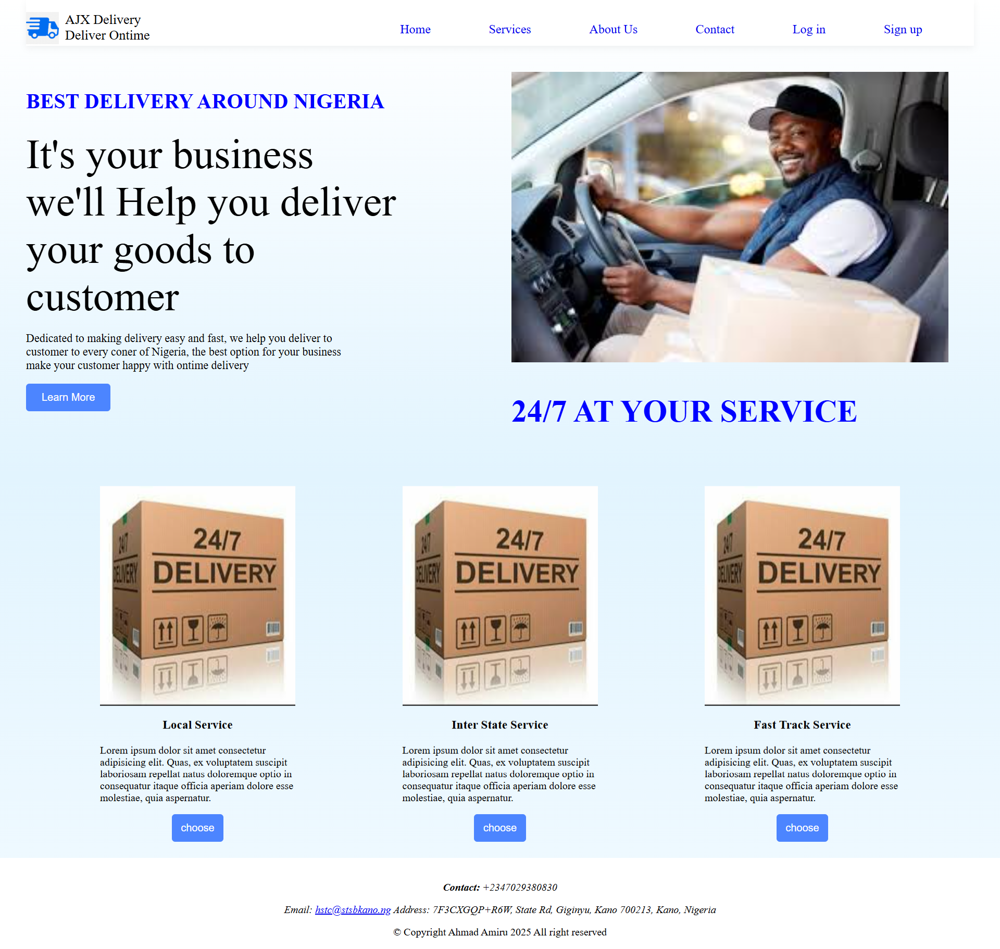
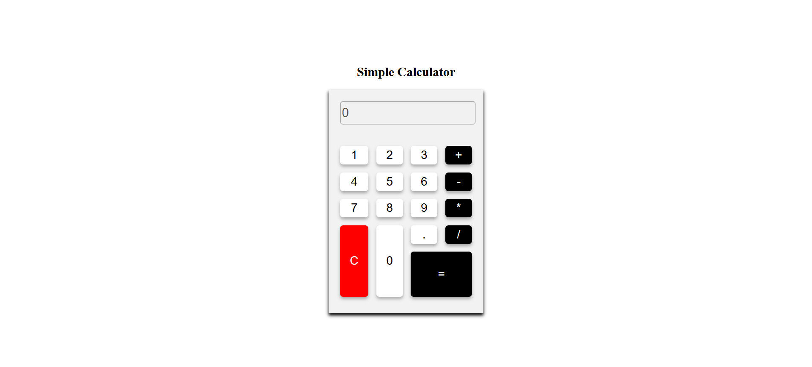
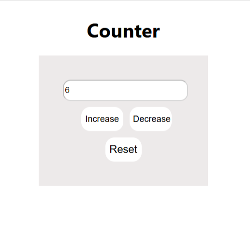

#This repo is for 3MTT Assessment
You can find all the assessment here You are welcome to suggest any improvement.

I will only share pictures of project that are fully function here.
For the rest you can look into codes in the repository.

##
##

**Mini2 Project** This is my second mini project.
##

##
##
**Simple calculator With HMTL, CSS, JS** 
##

##
##
**Number Counter With React**
##

##
##
# Movies Browser

#
The Movies Browser React app is structured into reusable components that each serve a specific function in the UI.
##
## 🔍 Before Search

##
##
## 🎯 After Search

You can acces the Movies Browser here https://github.com/Ajingi1/Movie-browser
